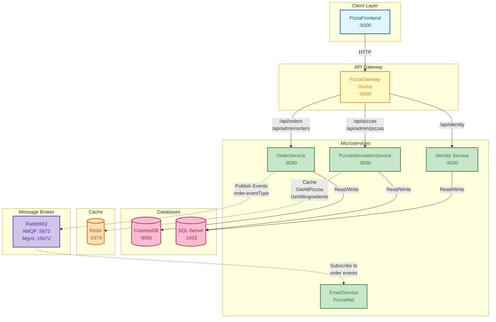

# BrightSwahnFlower - Pizza Ordering System

A microservices-based pizza ordering system built with .NET and Docker.

## Architecture Overview

The system consists of multiple microservices that communicate through an API Gateway and use message-based communication via RabbitMQ.



### Services

- **PizzaFrontend** (Localhost:5000): Web frontend for the pizza ordering system
- **PizzaGateway** (Port 8080): API Gateway using Ocelot for routing requests to microservices
- **OrderService** (Port 8080): Handles order creation and management, stores data in CosmosDB
- **PizzaInformationService** (Port 8080): Manages pizza and ingredient information, uses SQL Server with Redis caching for GetAllPizzas and GetAllIngredients queries
- **Identity Service** (Port 8080): Handles authentication (login, refresh, logout), uses SQL Server
- **EmailService**: Sends email notifications via RabbitMQ event subscriptions

### Infrastructure

- **SQL Server**: Database for PizzaInformationService and Identity Service
- **CosmosDB Emulator**: NoSQL database for OrderService
- **Redis**: Cache for PizzaInformationService (caches GetAllPizzas and GetAllIngredients queries)
- **RabbitMQ**: Message broker for asynchronous communication between services

### Communication Patterns

**Synchronous (HTTP):**
- Frontend communicates with all services through the API Gateway
- Gateway routes:
  - `/api/orders`, `/api/admin/orders` → OrderService
  - `/api/identity` → Identity Service
  - `/api/pizzas`, `/api/admin/pizzas` → PizzaInformationService

**Asynchronous (RabbitMQ):**
- OrderService publishes order events (e.g., `order.created`) to RabbitMQ
- EmailService subscribes to these events and sends email notifications

## Getting Started

### Prerequisites

- Docker and Docker Compose
- .NET 10.0 SDK (for local development)

### Running with Docker Compose

```bash
docker-compose up --build
```

This will start all services and their dependencies.

### Access Points

- Frontend: http://localhost:5000
- CosmosDB Emulator: https://localhost:8081_explorer/index.html
- RabbitMQ Management UI: http://localhost:15672 (username: guest, password: guest)
